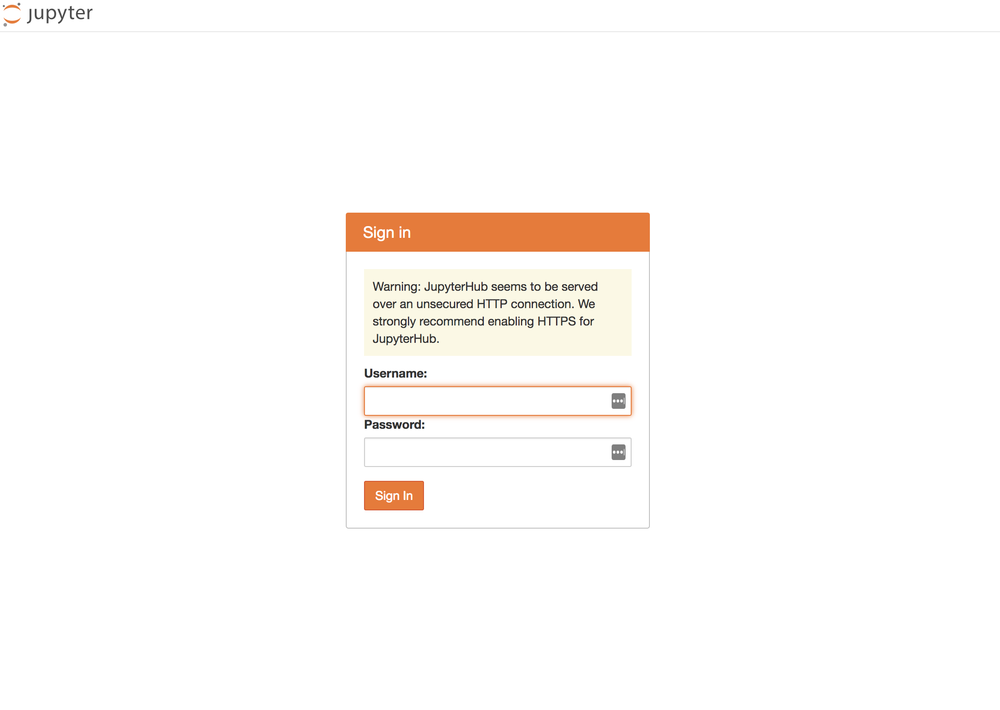
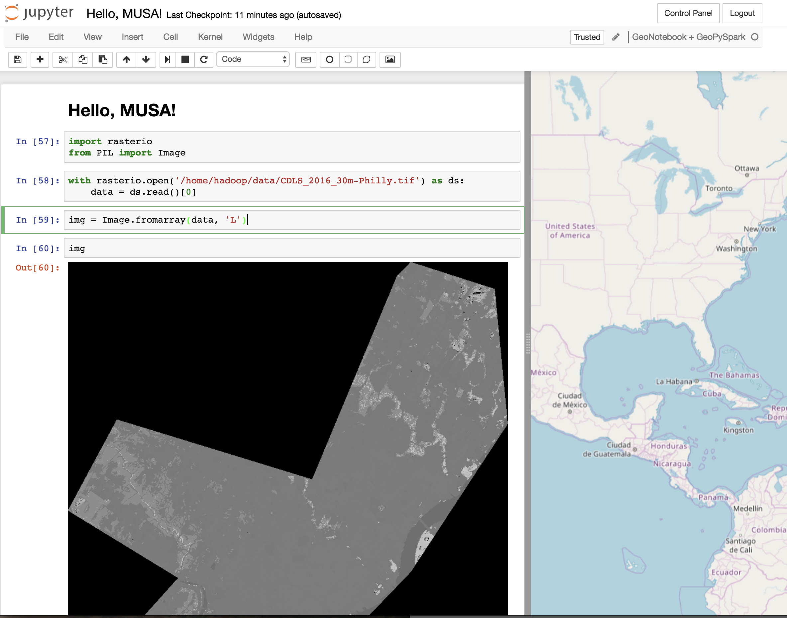

# MUSA Workshop: Raster Processing with Python

This repository holds code for a workshop run on April 23rd as part of UPenn [MUSA](http://penniur.upenn.edu/instruction/graduate/home.html) program.

This workshop will cover techniques in utilizing Python and an open source stack of Python libraries
for raster processing. We will go over how to load up raster data in Python using the
[rasterio](https://github.com/mapbox/rasterio) library, working with rasters as [numpy](http://www.numpy.org/)
arrays, and performing analysis on satellite imagery. The workshop will include coding  exercises
run through a [Jupyter Notebook](http://jupyter.org/).

### Check your setup

Please make sure you can run the following steps __before__ the workshop begins. If you have any problems with the setup, I'm happy to help. Put an issue on this repository with your issue, and we can work through it on GitHub.

To check your setup:

#### 0. Install the necessary tools

* [Git 2+](https://git-scm.com/book/en/v2/Getting-Started-Installing-Git)
* Docker - [Docker for Mac](https://www.docker.com/docker-mac), [Docker for Windows](https://www.docker.com/docker-windows), or regular docker. Install instructions for various OS's [are here](https://docs.docker.com/install/).

If you have a lot of trouble getting docker for working (especially with Windows), you might need to use an older method of running docker on Windows called DockerTools. A blog explaining this [setup is here](https://medium.com/@peorth/using-docker-with-virtualbox-and-windows-10-b351e7a34adc).

#### 1. Get the code

Clone this repository:

```shell
> git clone https://github.com/lossyrob/raster-processing-with-python-musa-2018
> cd raster-processing-with-python-musa-2018
```

#### 2. Build the docker image

This command will pull the base docker image and build on it locally. This pulls a pretty big docker image (1.2GB), so it's best to do this on a good internet connection.

```shell
> docker build -t musa/python-workshop -f Dockerfile .
```

#### 3. Run the docker container

```shell
> docker run -it --rm \
    -p 8000:8000 \
    -p 4040:4040 \
    -v `pwd`/notebooks:/home/hadoop/notebooks:rw \
    -v `pwd`/data:/home/hadoop/data:rw \
    -v `pwd`/musa:/usr/local/lib64/python3.4/site-packages/musa:ro \
    musa/python-workshop
```

__Note:__ If you are on windows, you'll need to remove ``pwd`` and set the volume to the `notebooks` and `data` directory manually. Here is a [blog article](https://rominirani.com/docker-on-windows-mounting-host-directories-d96f3f056a2c) talking about how to mount host directories into docker on Windows 10.

#### 4. Check it works

Visit [http://localhost:8000/](http://localhost:8000/). You should see something like:



You can log in with user `hadoop` and password `hadoop`.

#### 5. Run the Hello MUSA! Notebook

After logging in, click no the notebook named `Hello, MUSA!`. After the notebook is loaded, select `Cells` -> `Run All` to run all cells. You should see something like this:



#### 6. Success!

You're ready for the workshop!
